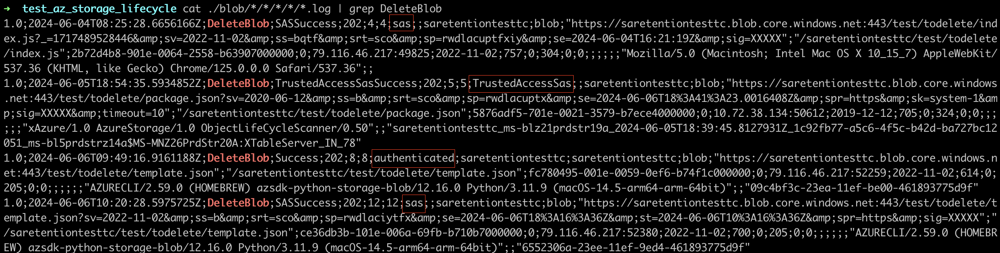
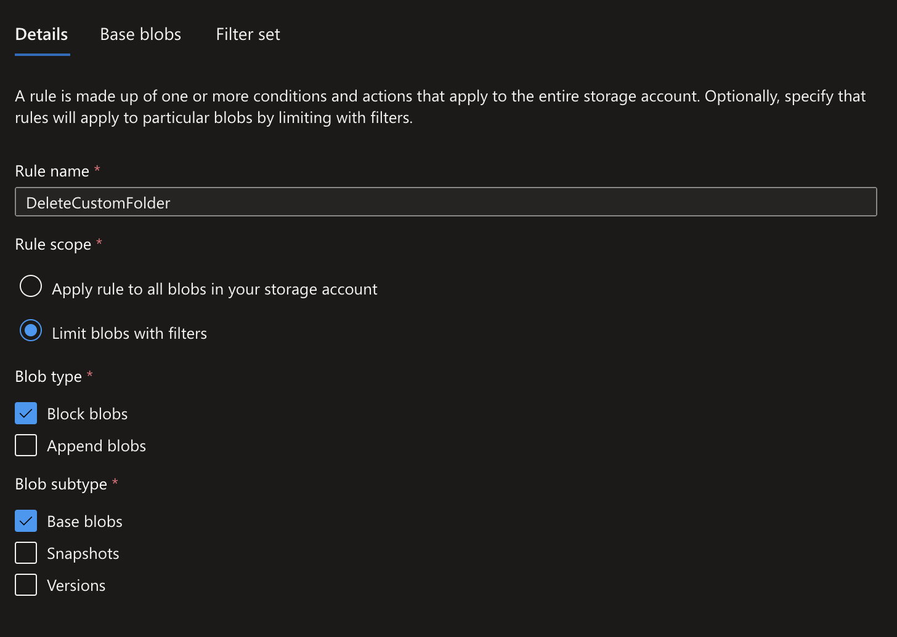
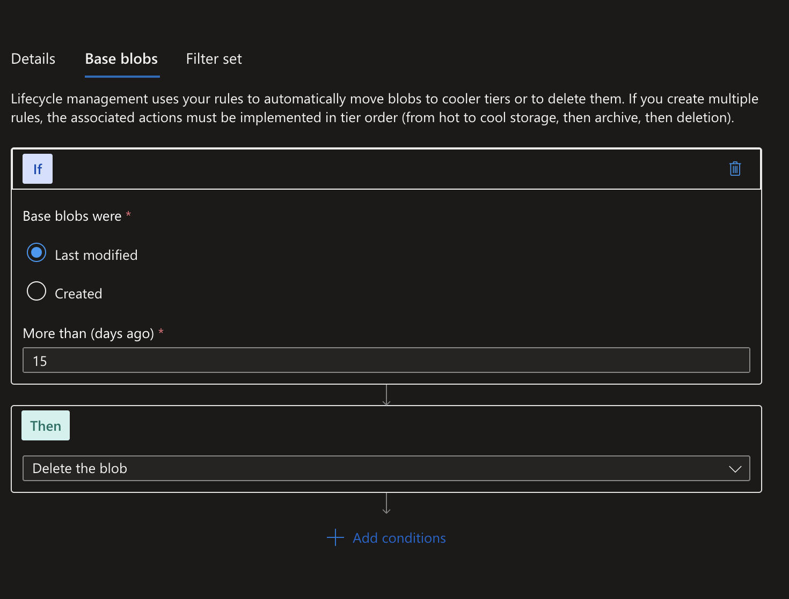
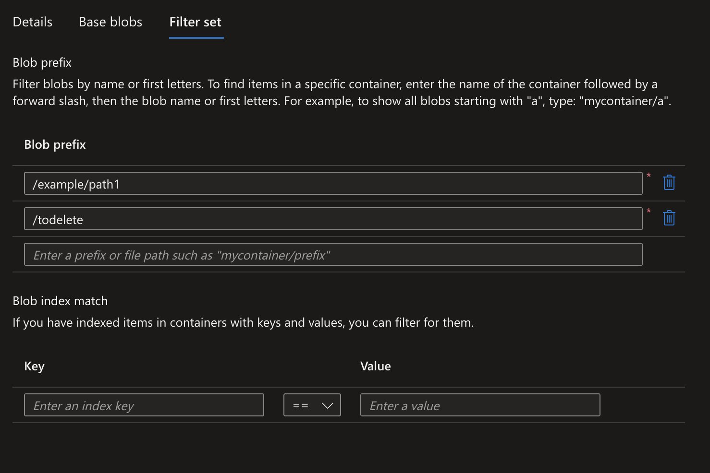

# Housekeeping using Azure Storage

Configure terminal envs

```bash
export RG="fdemos"
export CURRENT_SA="saretentiontesttc"
```

## Working with blobs

Download blobs

```bash
az storage blob download-batch --account-name $CURRENT_SA --source '$logs' --patter '*' --destination .
```

Upload blobs

```bash
az storage blob upload --account-name $CURRENT_SA --container-name test --name todelete/template.json  --file arm/template.json
```

Delete blob using az cli

```bash
az storage blob delete --account-name $CURRENT_SA --container-name test --name  todelete/template.json

# now using sas token
sastoken=".."
az storage blob delete --account-name $CURRENT_SA --container-name test --name  todelete/template.json --sas-token $sastoken
```

## Management policy

Get management policy configuration

```bash
az storage account management-policy show --account-name $CURRENT_SA  --resource-group $RG
```

See the difrence between manual deletion and management policy deletion

```bash
cat ./blob/*/*/*/*/*.log | grep DeleteBlob
```



Used methods to delete blobs:
- Using web interface
- Automatically by management policy
- Using az cli
- Using az cli with sas token


## Implementation using IaaC

Apply ARM template

```bash
az deployment group create --resource-group $RG --template-file arm/template.json --parameters arm/parameters_a.json
```








